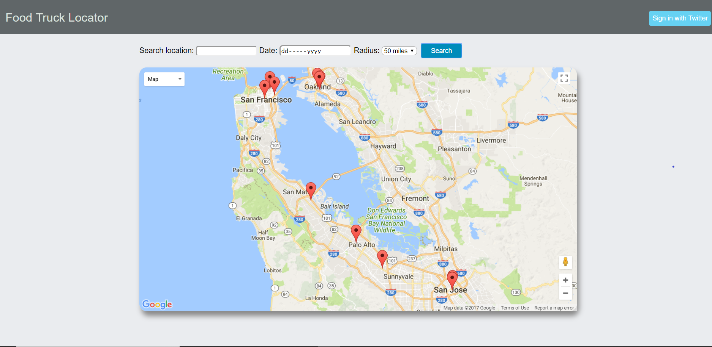
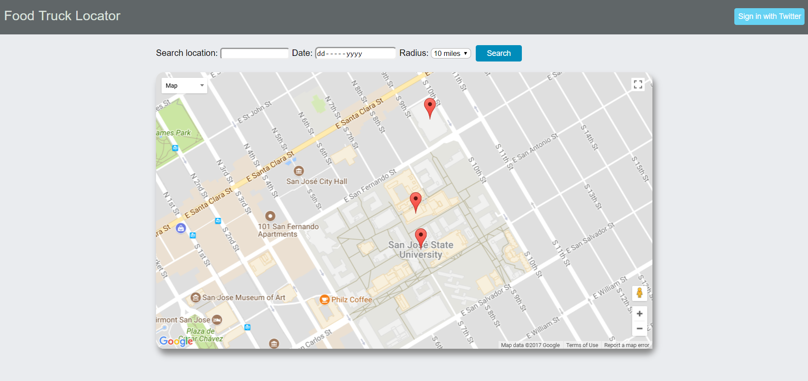
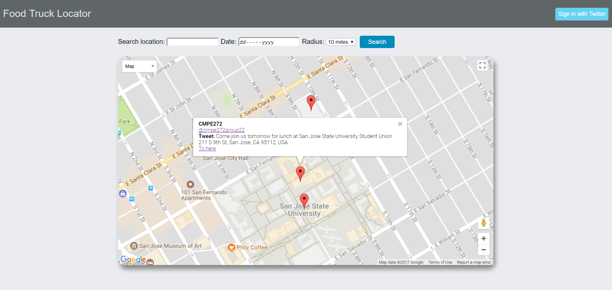
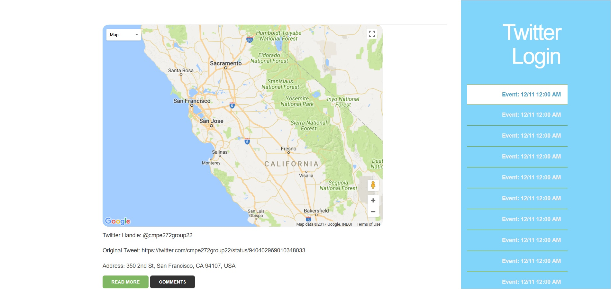

# Project-Team-22

### Project Name - Food Truck Locator

### Project Website : https://cmpe272group22-1.herokuapp.com/

#### Project description:

This project will gather and analyze data from two major sources to provide a map of local food
trucks events for everyone to browse.

- Search result

- Radius filter

- Information view on marker

- Twitter login page

- Logged in page (via Twitter)

#### Run web application:

1. Open project folder `Workspace`
2. Make sure MySQL is installed on your machine
3. Run `node index.js`
4. The application is running 

#### Run NLP event creater:

1. Open project folder `twitterEventCreater` using IntelliJ IDEA
2. Make sure Java JDK 8 is installed on your machine
3. Refresh gradle on IntelliJ IDEA
4. Click `Run >`
5. The application is running
